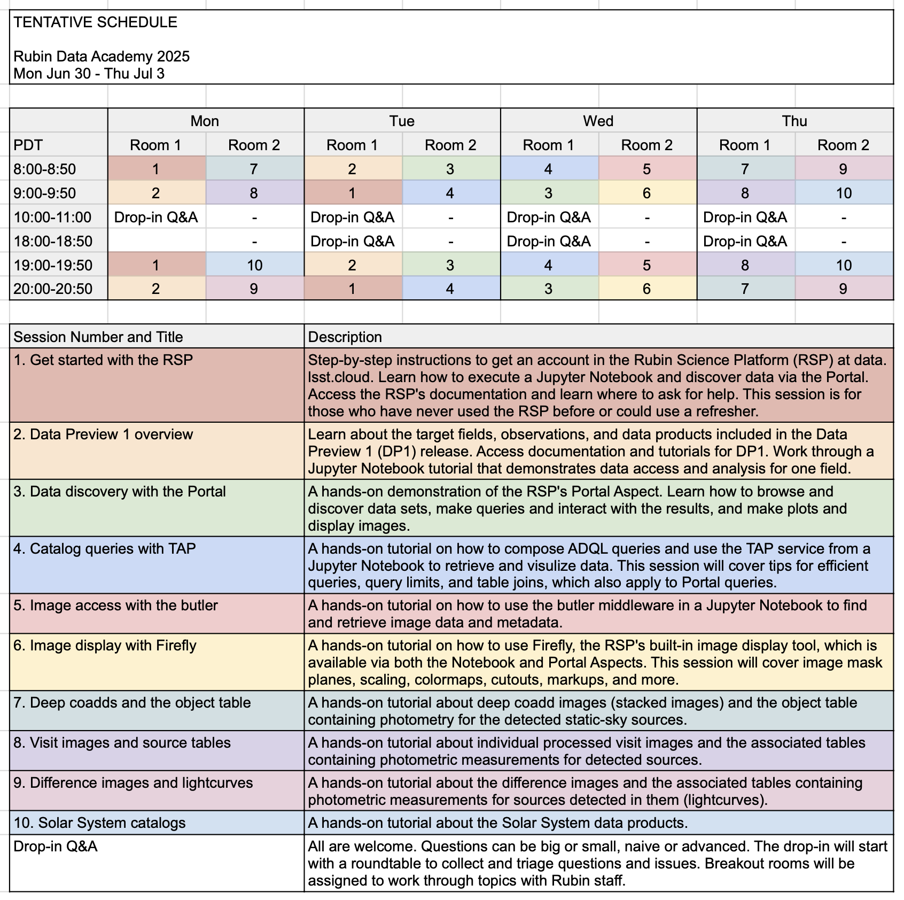

# Rubin Data Academy 2025

Mon Jul 30 to Thu Jul 3

Virtual

This year's Academy week is designed to provide a basic introduction to both the Rubin Science Platform's tools and the Data Preview 1 data release. Ten unique sessions will be run. Each session will occur at least twice. Two sessions will be run in parallel, mornings and evenings (US Pacific) for access from global timezones.

No registration is required to attend.

For Zoom connection info: ls.st/dp0-events

[Tentative schedule](https://docs.google.com/spreadsheets/d/1SQCgruYEkav70H4RaCm-Fc3B-U28ZJyHX8lQNqe8s2g/edit?usp=sharing).

